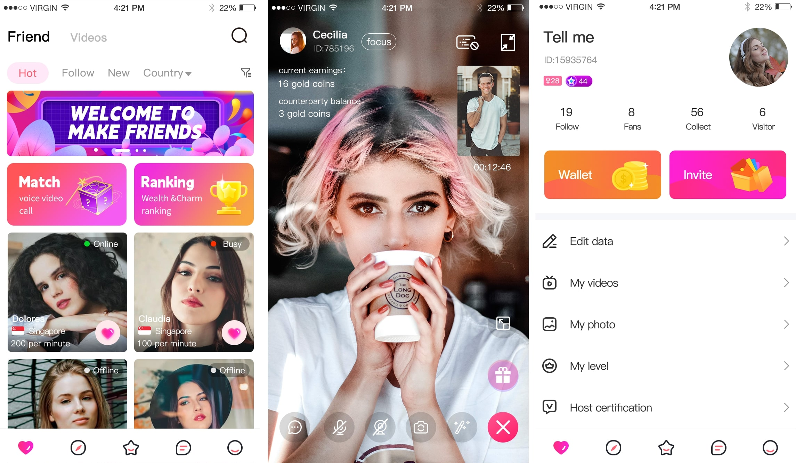

# Live Video Chat App Source Code - One-on-One Video Dating Platform

> Professional source code solution for one-on-one video chat and dating applications. Complete, scalable, and feature-rich platform similar to Tango, Chamet, and other popular video dating apps.

## 🚀 Product Overview

Our Live Video Chat App source code provides a complete solution for building premium one-on-one video dating and social interaction platforms. This application is designed for entrepreneurs and businesses looking to enter the lucrative video dating market with a professional, ready-to-deploy solution.

### 📱 Live Video Chat Platform
Professional one-on-one video chat application with advanced matching algorithms and monetization features.

*Complete video dating platform with smart matching and premium features*

---

## 🔥 **READY TO START YOUR VIDEO DATING BUSINESS?** 🔥

### 💬 **CONTACT US NOW FOR INSTANT ACCESS** 💬

| 📱 **WhatsApp** | 📧 **Email** | 📱 **Telegram** |
|:---:|:---:|:---:|
| [**🚀 CHAT NOW**](https://wa.me/8615715385900?text=I%20saw%20your%20Live%20Video%20Chat%20product%20on%20GitHub%20and%20would%20like%20to%20learn%20more%20about%20it) | **weipeng201707@gmail.com** | **@chaoxiaokalami** |

### 🎯 **GET COMPLETE SOURCE CODE + COMMERCIAL LICENSE** 🎯

---

## ✨ Core Features

### Video Chat & Communication
- **HD Video Calling** - Crystal clear one-on-one video communication
- **Real-time Audio Chat** - High-quality voice communication options
- **Text Messaging** - Instant messaging with emoji and sticker support
- **Screen Sharing** - Advanced communication features
- **Call Recording** - Optional call recording functionality
- **Multi-language Support** - Global audience compatibility

### Smart Matching System
- **Random Matching** - Instant random video chat connections
- **Filter-based Matching** - Age, location, gender, and interest filters
- **AI-powered Recommendations** - Smart user matching algorithms
- **Favorites System** - Save and reconnect with preferred users
- **Block & Report** - Advanced safety and moderation tools
- **VIP Matching** - Premium matching for paying users

### Monetization Features
- **Virtual Gifts** - Comprehensive virtual gift economy
- **Premium Subscriptions** - Multiple subscription tiers
- **Pay-per-Minute** - Flexible pricing for video calls
- **VIP Membership** - Exclusive features for premium users
- **In-app Purchases** - Coins, credits, and premium features
- **Revenue Analytics** - Detailed monetization tracking

### User Management & Safety
- **User Verification** - Photo and identity verification system
- **Profile Management** - Comprehensive user profiles
- **Privacy Controls** - Advanced privacy and security settings
- **Content Moderation** - AI-powered content filtering
- **Reporting System** - User safety and abuse reporting
- **Admin Dashboard** - Complete platform management

## 🛠️ Technical Stack

### Frontend Technologies
- **iOS**: Swift 5.0+, UIKit, AVFoundation, WebRTC
- **Android**: Kotlin/Java, Android SDK, WebRTC, Camera2 API
- **Cross-platform**: React Native / Flutter options available

### Backend Technologies
- **Server**: Node.js with Express / Python Django / Java Spring Boot
- **Database**: MongoDB, PostgreSQL, Redis for caching
- **Real-time Communication**: WebRTC, Socket.io, TURN/STUN servers
- **Video Processing**: FFmpeg, WebRTC media servers
- **Cloud Services**: AWS, Google Cloud, Azure compatible

### Key Integrations
- **Payment Gateways**: Stripe, PayPal, Apple Pay, Google Pay
- **Push Notifications**: Firebase Cloud Messaging, APNs
- **Analytics**: Google Analytics, custom analytics dashboard
- **CDN**: CloudFlare, AWS CloudFront for global delivery
- **Security**: SSL/TLS encryption, OAuth 2.0, JWT authentication
- **AI Services**: Machine learning for matching and content moderation

## 📱 Platform Support

- ✅ **iOS** (iOS 13.0+)
- ✅ **Android** (API Level 23+)
- ✅ **Web Admin Panel** (Complete management dashboard)
- ✅ **REST API** (Comprehensive API documentation)
- ✅ **WebRTC Support** (Cross-platform video calling)

## 🎯 Target Use Cases

### Business Applications
- **Video Dating Platforms** - Tango, Chamet-style applications
- **Social Discovery Apps** - Meet new people through video
- **International Dating** - Cross-cultural video dating platforms
- **Niche Dating Markets** - Specialized video dating communities
- **Adult Entertainment** - Premium video chat platforms
- **Language Exchange** - Video-based language learning platforms

### Market Opportunities
- **Global Dating Market** - Multi-billion dollar industry
- **Mobile-first Audience** - Growing smartphone user base
- **Premium Monetization** - High-value user engagement
- **International Expansion** - Worldwide market potential

## 💼 Complete Source Code Package

### Mobile Applications
- ✅ **Full iOS App** - Complete Xcode project with all features
- ✅ **Full Android App** - Complete Android Studio project
- ✅ **UI/UX Components** - Modern, attractive interface design
- ✅ **Video Call Engine** - WebRTC-based video communication
- ✅ **Payment Integration** - Multiple payment gateway support
- ✅ **Push Notifications** - Real-time notification system

### Backend System
- ✅ **Server Code** - Complete backend implementation
- ✅ **Database Schema** - Optimized database structure
- ✅ **API Documentation** - Comprehensive REST API docs
- ✅ **Admin Dashboard** - Web-based management interface
- ✅ **Analytics System** - User behavior and revenue tracking
- ✅ **Content Moderation** - AI-powered safety features

### Additional Resources
- 📚 **Technical Documentation** - Complete setup and customization guide
- 🔧 **Configuration Files** - Ready-to-use server configurations
- 🎨 **Design Assets** - All UI elements and graphics
- 🧪 **Testing Suite** - Unit tests and integration tests
- 📊 **Analytics Dashboard** - Revenue and user analytics
- 🛡️ **Security Features** - Complete security implementation

## 🚀 Quick Start Guide

1. **Download Package** - Get the complete source code bundle
2. **Environment Setup** - Configure development environment
3. **Database Installation** - Set up MongoDB/PostgreSQL database
4. **Server Deployment** - Deploy backend services
5. **Mobile App Build** - Compile iOS and Android applications
6. **Payment Configuration** - Set up payment gateways
7. **Testing & Launch** - Test all features and go live

## 💡 Customization & White-Label Options

### Branding Customization
- **Complete White-Label** - Full branding customization
- **Custom UI/UX** - Modify interface design and user experience
- **Logo & Colors** - Brand-specific visual identity
- **App Store Presence** - Custom app store listings

### Feature Customization
- **Matching Algorithms** - Customize user matching logic
- **Monetization Models** - Flexible revenue strategies
- **Regional Features** - Localization for specific markets
- **Integration Options** - Third-party service integrations

### Technical Customization
- **Server Architecture** - Scalable deployment options
- **Database Optimization** - Performance tuning
- **Security Enhancements** - Additional security measures
- **API Extensions** - Custom API development

## 📈 Revenue Potential

### Monetization Strategies
- **Subscription Revenue** - Recurring monthly/yearly subscriptions
- **Virtual Gifts** - High-margin virtual item sales
- **Premium Features** - Pay-per-use premium functionality
- **Advertising Revenue** - Integrated advertising opportunities
- **Commission Model** - Revenue sharing with content creators

### Market Statistics
- Global video dating market: $8+ billion annually
- Average user lifetime value: $50-200+
- Premium conversion rates: 5-15%
- Monthly active user potential: Unlimited scalability

---

# 🚀💰 **CONTACT & PURCHASE - START EARNING TODAY!** 💰🚀

## 🔥 **LAUNCH YOUR MILLION-DOLLAR VIDEO DATING PLATFORM** 🔥

### 💎 **What You Get When You Contact Us** 💎

| 🎯 **Package** | 💼 **What's Included** | 🚀 **Value** |
|:---:|:---:|:---:|
| **🏆 Complete Source Code** | Full iOS + Android + Backend + Admin Panel | **$10,000+ Value** |
| **⚡ Custom Development** | Tailored features and brand customization | **$5,000+ Value** |
| **🛠️ Technical Support** | Expert setup, deployment & troubleshooting | **$2,000+ Value** |
| **📈 Business Consultation** | Market strategy & monetization optimization | **$3,000+ Value** |

---

## 📱💬 **CONTACT US NOW - DON'T MISS OUT!** 💬📱

### 🔥 **MULTIPLE WAYS TO REACH US INSTANTLY** 🔥

<table align="center">
<tr>
<td align="center" width="33%">

### 📱 **WhatsApp**
### 🚀 **FASTEST RESPONSE**
**[💬 CHAT NOW](https://wa.me/8615715385900?text=I%20saw%20your%20Live%20Video%20Chat%20product%20on%20GitHub%20and%20would%20like%20to%20learn%20more%20about%20it)**
*Get instant reply within minutes!*

</td>
<td align="center" width="33%">

### 📧 **Email**
### 📝 **DETAILED INQUIRIES**
**weipeng201707@gmail.com**
*Send us your requirements*
*and get a custom quote!*

</td>
<td align="center" width="33%">

### 📱 **Telegram**
### ⚡ **QUICK CHAT**
**@chaoxiaokalami**
*Direct line to our*
*technical team!*

</td>
</tr>
</table>

---

### 🎯 **READY TO DOMINATE THE $8 BILLION VIDEO DATING MARKET?** 🎯

### 💰 **START YOUR PROFITABLE BUSINESS TODAY!** 💰

---

---

## 📄 Commercial License

This is premium commercial software. Source code is available for purchase with:
- ✅ **Full Commercial Rights** - Use for commercial purposes
- ✅ **Unlimited Projects** - Deploy multiple applications
- ✅ **Source Code Access** - Complete codebase ownership
- ✅ **Technical Support** - Initial setup and deployment assistance
- ✅ **Updates & Maintenance** - Ongoing technical support options

## 🔒 Security & Compliance

### Security Features
- **End-to-end Encryption** - Secure video and audio communication
- **User Verification** - Multi-level identity verification
- **Content Filtering** - AI-powered inappropriate content detection
- **Privacy Protection** - GDPR and privacy regulation compliance
- **Secure Payments** - PCI DSS compliant payment processing
- **Data Protection** - Advanced data security measures

### Compliance Standards
- **GDPR Compliant** - European data protection regulations
- **COPPA Compliant** - Child safety and privacy protection
- **App Store Guidelines** - iOS and Android store compliance
- **Payment Security** - Industry-standard payment protection
- **Content Moderation** - Community guidelines enforcement

---

**© 2024 BogoTech. All rights reserved.**

*Professional live video chat and dating application source code solution. Ready to deploy, scale, and monetize for your business success.*
